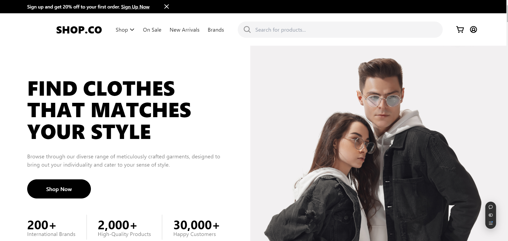
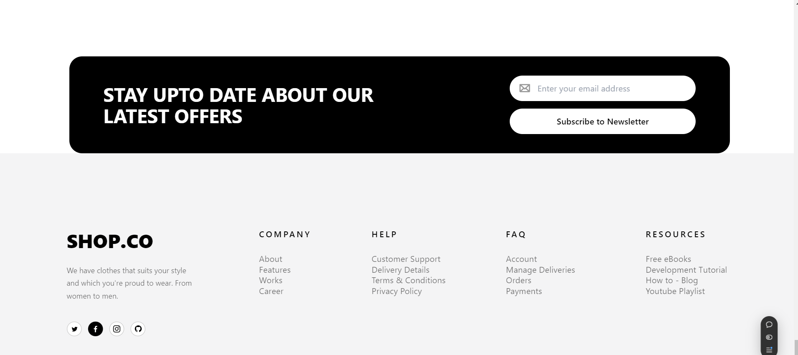

# SHOP.CO

## Project Overview

Developed an e-commerce frontend based on the a Figma design. The project will utilize React.js, Tailwind CSS, and JavaScript for the implementation. The Figma file containing the design can be accessed [here](https://www.figma.com/design/uWZy3sLKaozacmQtYw9g2H/Shop.co?node-id=0-1&node-type=canvas&t=HJdj1IOMlWtGBu0O-0).

## Requirements

- Recreate the a Figma design into a fully functional frontend.
- Implement animations as per the design for a smooth user experience (e.g., hover effects, page transitions).
- Ensure the website is responsive and works well on mobile, tablet, and desktop screens.

## Features

- Product listing
- Shopping cart functionality
- Live chat support in Future
- Payment integration in Future

## Technologies Used

- **Frontend:** React.js, Tailwind CSS, Javascript, Css

## Live Demo

You can view the live application at [Shop-co Live Demo](https://shop-co-iota.vercel.app/).

## Installation

1. Clone the repository:

   ```bash
   git clone https://github.com/thowfeek-dev/Shop-co.git
   ```

2. Navigate to the project directory:

   ```bash
   cd Shop-co
   ```

## Usage

1. Start the frontend application:

   ```bash
   npm start
   ```

3. Open your browser and go to `http://localhost:3000` to view the application.

## Contributing

Contributions are welcome! Please open an issue or submit a pull request for any improvements or bug fixes.

## License

This project is licensed under the MIT License - see the [LICENSE](LICENSE) file for details.

## Acknowledgments

- Thank you to all contributors and libraries that made this project possible.


